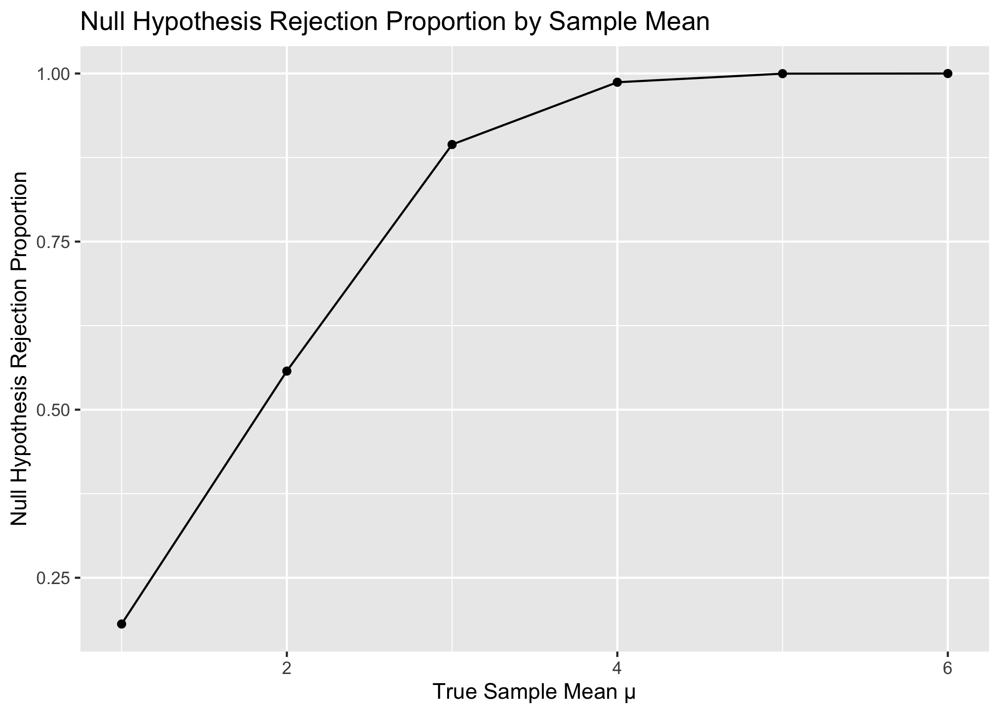
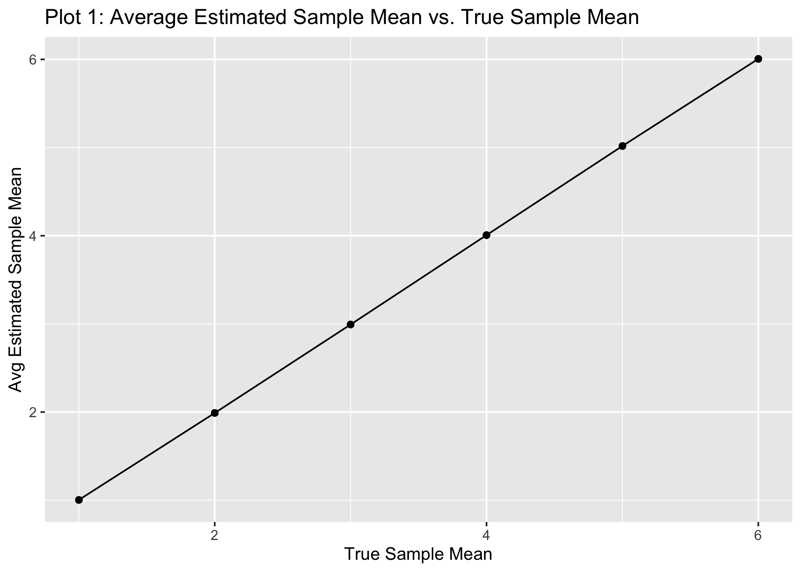
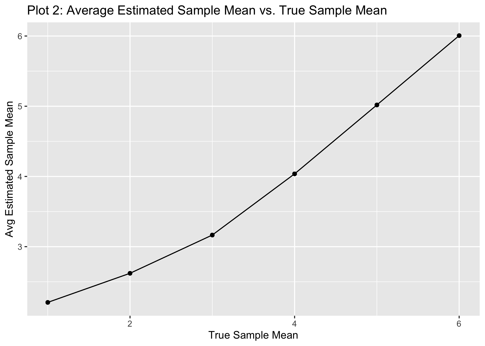

p8105_hw5_sef2183
================
Sarah Forrest
2022-11-07

# Problem 1

Tidy dataframe containing subject IDs, study arm, and observations by
week:

My solution:

``` r
con_files = list.files(path = 'data/', pattern = "^con_.*", full.names = TRUE)
exp_files = list.files(path = 'data/', pattern = "^exp_.*", full.names = TRUE)

con_df = 
  map_dfr(con_files, read_csv) %>%
  mutate(arm = "control")
  
exp_df = 
  map_dfr(exp_files, read_csv) %>%
  mutate(
    arm = "experimental")

study_df = 
  rbind(con_df, exp_df) %>%
  group_by(arm) %>%
  mutate(id = 1:n()) %>%
  pivot_longer(
    starts_with("week"),
    names_to = "week",
    names_prefix = "week_", 
    values_to = "value"
  ) %>%
  select(id, arm, week, value)
```

Jeff’s solution:

``` r
full_df = 
  tibble(
    files = list.files("data/"),
    path = str_c("data/", files)
  ) %>% 
  mutate(data = map(path, read_csv)) %>% 
  unnest()
## Warning: `cols` is now required when using unnest().
## Please use `cols = c(data)`

tidy_df = 
  full_df %>% 
  mutate(
    files = str_replace(files, ".csv", ""),
    group = str_sub(files, 1, 3)) %>% 
  pivot_longer(
    week_1:week_8,
    names_to = "week",
    values_to = "outcome",
    names_prefix = "week_") %>% 
  mutate(week = as.numeric(week)) %>% 
  select(group, subj = files, week, outcome)
```

Spaghetti plot showing observations on each subject over time:

``` r
tidy_df %>% 
  ggplot(aes(x = week, y = outcome, group = subj, color = group)) + 
  geom_point() + 
  geom_path() + 
  facet_grid(~group)
```

<!-- -->

This plot suggests high within-subject correlation – subjects who start
above average end up above average, and those that start below average
end up below average. Subjects in the control group generally don’t
change over time, but those in the experiment group increase their
outcome in a roughly linear way.

# Problem 2 - Homicide Data

Read in the Washington Post’s data on homicides in 50 large U.S. cities
from GitHub:

``` r
homicide_df = 
  read.csv("https://raw.githubusercontent.com/washingtonpost/data-homicides/master/homicide-data.csv") 
```

The raw data contains 52179 rows of homicide observations and 12
variables: homicide ID, date, the victim’s first and last name, age,
sex, city, state, latitude, longitude, and disposition.

## Create City Dataframe

The code below creates a dataframe with the total number of homicides
and the number of unsolved homicides in each city. A `city_state`
variable was created and then the totals were summarized within each
city. Note that the “homicides_unresolved” variable contains the total
number of homicides for which the disposition is “Closed without arrest”
or “Open/No arrest”. Additionally, the raw data contained an entry where
the `state` value for Tulsa, OK was incorrectly entered as AL. This was
data entry error was corrected in the dataframe creation below:

``` r
city_df = 
  homicide_df %>%
  mutate(
    city_state = paste(city, state, sep = ", ")) %>%
   mutate(
    city_state = if_else(city_state == "Tulsa, AL", "Tulsa, OK", city_state))  %>%
  group_by(city_state) %>%
  summarize(
    homicides_total = n(),
    homicides_unresolved = sum(disposition != "Closed by arrest"))

city_df
## # A tibble: 50 × 3
##    city_state      homicides_total homicides_unresolved
##    <chr>                     <int>                <int>
##  1 Albuquerque, NM             378                  146
##  2 Atlanta, GA                 973                  373
##  3 Baltimore, MD              2827                 1825
##  4 Baton Rouge, LA             424                  196
##  5 Birmingham, AL              800                  347
##  6 Boston, MA                  614                  310
##  7 Buffalo, NY                 521                  319
##  8 Charlotte, NC               687                  206
##  9 Chicago, IL                5535                 4073
## 10 Cincinnati, OH              694                  309
## # … with 40 more rows
```

## Unsolved Homicides in Baltimore, MD

The code below calculates the proportion (with confidence limits) of
homicides that are unsolved in Baltimore, MD. This is done by filtering
the `city_df` dataframe created above to only observations where
`city_state` = “Baltimore, MD”. Then, the `prop.test` function was used
to calculate the proportion of `homicides_unresolved`(# of “events”)
over `homicides_total`(# of “trails”). The estimated proportion, lower
confidence limit, and upper confidence limit values were pulled from the
output and reported in the table below:

``` r
baltimore_df = 
  city_df %>%
  filter(city_state == "Baltimore, MD") 

prop_unresolved =
  prop.test(
    x = pull(baltimore_df, homicides_unresolved), 
    n = pull(baltimore_df, homicides_total))

prop_unresolved %>%
  broom::tidy() %>%
  select(estimate, conf.low, conf.high) %>%
  knitr::kable(
    col.names = c('estimated proportion', 'lower confidence limit', 'upper confidence limit'))
```

| estimated proportion | lower confidence limit | upper confidence limit |
|---------------------:|-----------------------:|-----------------------:|
|            0.6455607 |              0.6275625 |              0.6631599 |

## Unsolved Homicides in All 50 Cities

The code below calculates the proportion (with confidence limits) of
homicides that are unsolved in all cities. This is done by nesting
variables `homicides_total` and `homicides_unresolved` from the
`city_df` dataframe. Then, a function called “prop_conflimits” is
created that takes in a dataframe and applies the `prop.test` function
was to calculate the proportion of `homicides_unresolved`(# of “events”)
over `homicides_total`(# of “trails”) and pull the the estimated
proportion and confidence limits from the output. This function is
called and mapped to a new `prop_estimates` variable which is then
unnested and assigned to a new `city_prop_df` dataframe. The
`city_prop_df` dataframe contains 50 rows (1 row for each city) and 6
variables: `city_state`, total number of homicides `homicides_total`,
total number of unsolved homicides `homicides_unresolved`, the
proportion of homicides that are unsolved `prop_unresolved_est`, the
lower confidence limit for the proportion estimate `conf_lower`, and the
upper confidence limit for the proportion estimate `conf_upper`:

``` r
city_nest_df = 
  city_df %>% 
  nest(data = homicides_total:homicides_unresolved)


prop_conflimits = function(df) {
  
  prop_unresolved =
  prop.test(
    x = pull(df, homicides_unresolved), 
    n = pull(df, homicides_total))

prop_unresolved %>%
  broom::tidy() %>%
  select(estimate, conf.low, conf.high)
}


city_nest_df %>% 
  mutate(prop_estimates = map(data, prop_conflimits)) %>% 
  unnest(data, prop_estimates) %>% 
  rename(
    prop_unresolved_est = estimate,
    conf_lower = conf.low,
    conf_upper = conf.high) -> city_prop_df
## Warning: unnest() has a new interface. See ?unnest for details.
## Try `df %>% unnest(c(data, prop_estimates))`, with `mutate()` if needed

city_prop_df
## # A tibble: 50 × 6
##    city_state      homicides_total homicides_unresolved prop_u…¹ conf_…² conf_…³
##    <chr>                     <int>                <int>    <dbl>   <dbl>   <dbl>
##  1 Albuquerque, NM             378                  146    0.386   0.337   0.438
##  2 Atlanta, GA                 973                  373    0.383   0.353   0.415
##  3 Baltimore, MD              2827                 1825    0.646   0.628   0.663
##  4 Baton Rouge, LA             424                  196    0.462   0.414   0.511
##  5 Birmingham, AL              800                  347    0.434   0.399   0.469
##  6 Boston, MA                  614                  310    0.505   0.465   0.545
##  7 Buffalo, NY                 521                  319    0.612   0.569   0.654
##  8 Charlotte, NC               687                  206    0.300   0.266   0.336
##  9 Chicago, IL                5535                 4073    0.736   0.724   0.747
## 10 Cincinnati, OH              694                  309    0.445   0.408   0.483
## # … with 40 more rows, and abbreviated variable names ¹​prop_unresolved_est,
## #   ²​conf_lower, ³​conf_upper
```

## Plots

The code below creates a plot showing the proportion (with confidence
limits) of homicides that are unsolved in each city:

``` r
city_prop_df %>%
  mutate(city_state = fct_reorder(city_state, prop_unresolved_est)) %>%
  ggplot(aes(x = city_state, y = prop_unresolved_est)) +
  geom_point() +
  geom_errorbar(aes(ymin = conf_lower, ymax = conf_upper), width = 0.2) + 
  theme(axis.text.x = element_text(angle = 90, hjust = 1)) +
  labs(
    title = "Proportion of Homicides That are Unsolved in 50 U.S. Cities",
    x = "City",
    y = "Proportion")
```

<!-- -->

# Problem 3 - Simulation

## Generate Data

The code below generates 5000 datasets with $n=30$, $\alpha=5$, and
$\mu=0$:

``` r
df = map(1:5000, ~ rnorm(n = 30, mean = 0, sd = 5))
```

## Create Function

The code below creates a function called `estmean_pvalue` to calculate
the estimated mean $\hat{\mu}$ and the p-value arising from a test of
H:$\mu=0$ using $\alpha = 0.05$ and create a tibble dataframe from the
resulting calculations:

``` r
estmean_pvalue = function(n_obs = 30, mu, sigma = 5) {
  
  x = rnorm(n = n_obs, mean = mu, sd = sigma)
  tibble(
    mu_hat = mean(x),
    p_value = t.test(x, mu = 0)$p.value # CHECK THIS
  )
  
}

estmean_pvalue = function(n_obs = 30, mu, sigma = 5) {
  
  x = rnorm(n = n_obs, mean = mu, sd = sigma)
  tibble(
    mu_hat = mean(x),
    p_value = t.test(x, mu = 0)$p.value
  )
  
}
```

## Apply Function to Datasets for Mean = 0

The code below saves the $\hat{\mu}$ and the p-value arising from a test
of H:$\mu=0$ using $\alpha = 0.05$ for each dataset using the
`estmean_pvalue` function created above. The `estmean_pvalue` function
is mapped to a new `estimates_df` variable which is then unnested and
assigned to the `df_mu_0` dataframe with 5,000 rows containing 6
variables: `n` (30 for all), `mu`, (0 for all) `sigma` (5 for all),
`mu_hat`, and `p_value`.

``` r
df_mu_0 = 
  expand_grid(
    n = 30,
    mu = 0,
    sigma = 5,
    dataset = 1:5000) %>% 
  mutate(
    estimates_df = 
      map(.x = mu, ~estmean_pvalue(mu = .x))) %>% 
  unnest(estimates_df)

df_mu_0
## # A tibble: 5,000 × 6
##        n    mu sigma dataset mu_hat p_value
##    <dbl> <dbl> <dbl>   <int>  <dbl>   <dbl>
##  1    30     0     5       1  0.520   0.549
##  2    30     0     5       2  1.11    0.188
##  3    30     0     5       3  1.01    0.220
##  4    30     0     5       4 -0.835   0.309
##  5    30     0     5       5 -0.892   0.365
##  6    30     0     5       6  0.557   0.503
##  7    30     0     5       7  1.04    0.238
##  8    30     0     5       8  1.40    0.144
##  9    30     0     5       9  1.15    0.180
## 10    30     0     5      10 -0.500   0.634
## # … with 4,990 more rows
```

## Apply Function to Datasets for Mean = 1, 2, 3, 4, 5, 6

The code below saves the $\hat{\mu}$ and the p-value arising from a test
of H:$\mu=0$ using $\alpha = 0.05$ for each dataset using the
`estmean_pvalue` function for $\mu={1,2,3,4,5,6}$. The `estmean_pvalue`
function is mapped to a new `estimates_df` variable which is then
unnested and assigned to the `df_mu_all` dataframe with 30,000 rows
containing 6 variables: `n` (30 for all), `mu`, (values of 1-6) `sigma`
(5 for all), `mu_hat`, and `p_value`.

``` r
df_mu_all = 
  expand_grid(
    n = 30,
    mu = c(1, 2, 3, 4, 5, 6),
    sigma = 5,
    dataset = 1:5000) %>% 
  mutate(
    estimates_df = 
      map(.x = mu, ~estmean_pvalue(mu = .x))) %>% 
  unnest(estimates_df)

df_mu_all
## # A tibble: 30,000 × 6
##        n    mu sigma dataset mu_hat  p_value
##    <dbl> <dbl> <dbl>   <int>  <dbl>    <dbl>
##  1    30     1     5       1  1.59  0.0682  
##  2    30     1     5       2  0.911 0.287   
##  3    30     1     5       3  1.75  0.0909  
##  4    30     1     5       4  1.96  0.0306  
##  5    30     1     5       5  1.84  0.0847  
##  6    30     1     5       6  3.35  0.000262
##  7    30     1     5       7  1.70  0.0547  
##  8    30     1     5       8  0.954 0.308   
##  9    30     1     5       9  0.404 0.643   
## 10    30     1     5      10  1.51  0.0914  
## # … with 29,990 more rows
```

## Plots

### Proportion of times the null was rejected vs. true value of the mean

The code below creates a plot showing the proportion of times the null
was rejected (the power of the test) on the y axis and the true value of
$\mu$ on the x axis:

``` r
df_mu_all %>%
  group_by(mu) %>%
  summarise(
    cnt_nullreject = sum(p_value < 0.05),
    cnt = n()) %>%
  mutate(
    prop_nullreject = cnt_nullreject / cnt)  %>% 
  ggplot(aes(x = mu, y = prop_nullreject)) + 
  geom_point() + 
  labs(
    title = "Null Hypothesis Rejection Proportion by Sample Mean",
    x = "True Sample Mean μ",
    y = "Null Hypothesis Rejection Proportion")
```

<!-- -->

As the true sample mean increases (i.e., deviates further from 0), the
power (proportion of times the null was rejected) increases. When the
true sample mean is 1, the power of the test H:$\mu=0$ using
$\alpha = 0.05$ is very low. However, when the true sample mean
increases to 5, the power of the test H:$\mu=0$ using $\alpha = 0.05$
is 1. Therefore, large effect sizes increase statistical power.

### Average estimate of the mean vs. true value of the mean

The code below creates a plot showing the average estimate of
$\hat{\mu}$ vs. the true value of $\mu$:

``` r
df_mu_all %>%
  group_by(mu) %>%
  mutate(avg_mu_hat = mean(mu_hat)) %>%
  ggplot(aes(x = mu, y = avg_mu_hat)) +
  geom_point() + 
  labs(
    title = "Plot 1: Average Estimated Sample Mean vs. True Sample Mean",
    x = "True Sample Mean",
    y = "Avg Estimated Sample Mean")
```

<!-- -->

The code below creates a plot showing the average estimate of
$\hat{\mu}$ vs. the true value of $\mu$ only in samples for which the
null was rejected:

``` r
df_mu_all %>%
  filter(p_value < 0.05) %>%
  group_by(mu) %>%
  mutate(avg_mu_hat = mean(mu_hat)) %>%
  ggplot(aes(x = mu, y = avg_mu_hat)) +
  geom_point() + 
  labs(
    title = "Plot 2: Average Estimated Sample Mean vs. True Sample Mean",
    x = "True Sample Mean",
    y = "Avg Estimated Sample Mean")
```

<!-- -->

The sample average of $\hat{\mu}$ across tests for which the null is
rejected approximately equal to the true value of $\mu$ for higher $\mu$
values of 4, 5, and 6. The average $\hat{\mu}$ is a bit off from the
true value of $\mu$ for lower $\mu$ values of 1, 2 and 3. This is
because these lower values are closer to the null value of 0, so they
have a lower proportion of rejecting the null hypothesis compared to the
higher values of 4-6. Since the dataset for plot 2 was restricted to
only samples for which the null was rejected, the $\mu$ = 1 group has
much fewer samples included in the $\hat{\mu}$ average calculation
compared to the $\mu$ = 6 group. More samples results in an average
value of $\hat{\mu}$ that is approximately equal to the true value of
$\mu$ for higher values of $\mu$. In contrast, fewer samples included in
the average $\hat{\mu}$ calculation for lower values of $\mu$ results in
a$\hat{\mu}$ that is close, but a bit off from the true value of $\mu$.
